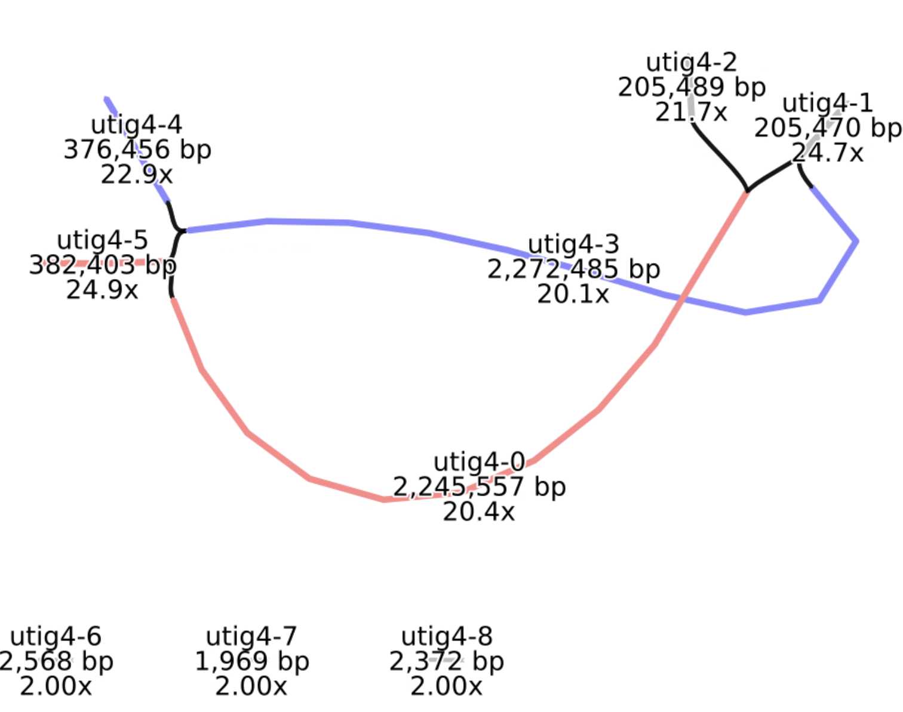
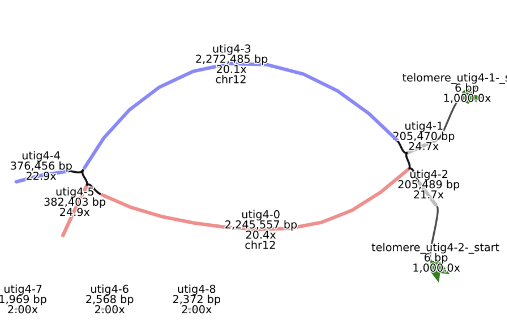

# Verkko tutorial

Get a "Regular" instance: 4 cores, 8 G RAM, 30 GB Storage

## Learning goals

 - Understand verkko steps
 - Run verkko
 - Inspect logging output as it runs
 - Get familiarized with assembly outputs

 ## Where's the data?

 - Included in the GitPod when launched
 - Can be downloaded from https://obj.umiacs.umd.edu/training/bga2024_verkko_t2t_data.tar.gz 

## Generating the assembly

Let's try an assembly of some test data. First, let's get familiar with verkko syntax
```bash
verkko --help
```
now let's give it some data and see what it will do
```bash
 verkko -d test --hifi hifi.fasta.gz --nano ont.fasta.gz --hic1 hic.R1.fastq.gz --hic2 hic.R2.fastq.gz --snakeopts --dry-run --screen human|more
```

<details><summary><b>What if I have multiple input files?</b></summary>
Verkko will take arbitary lists of inputs for each parameter so wildcards are ok (<code>ont*.fastq.gz</code> for example). Only one caveat, the Hi-C pairs have to be sorted in the same order to maintain read pairing (that is if you give <code>file1_R1.fastq.gz file2_R2.fastq.gz</code> to --hic1 you cannot give <code>file2_R2.fastq.gz file1_R1.fastq.gz1</code> to --hic2).
</details>

Now, let's run it for real (it will take 10-15 min)
```bash
 verkko -d test --hifi hifi.fasta.gz --nano ont.fasta.gz --hic1 hic.R1.fastq.gz --hic2 hic.R2.fastq.gz --no-correction --screen human
```

<b>Note: we would normally not use `--no-correction` but we want it to run faster for this tutorial.</b> While waiting, we can go through the [presentation](verkko.pdf) explaining how verkko works, motivation behind the steps, and some things that can go wrong.

### Let’s take a look at the outputs
```bash
ls -h test/
0-correction     8-hicPipeline                              assembly.paths.tsv
1-buildGraph     assembly.colors.csv                        assembly.scfmap
2-processGraph   assembly.disconnected.fasta                assembly.unassigned.fasta
3-align          assembly.fasta                             emptyfile
3-alignTips      assembly.haplotype1.fasta                  hifi-corrected.fasta.gz
4-processONT     assembly.haplotype2.fasta                  snakemake.sh
5-untip          assembly.homopolymer-compressed.gfa        verkko.yml
6-layoutContigs  assembly.homopolymer-compressed.layout
7-consensus      assembly.homopolymer-compressed.noseq.gfa
```
#### Some of the important outputs:
<dl>
<dt>assembly.fasta</dt>
<dd>The main output, all sequences as fasta</dd>
<dt>assembly.haplotype*.fasta</dt>
<dd>Output if you have phasing information like trio or Hi-C (like we did here)</dd>
<dt>assembly.homopolymer-compressed[.noseq].gfa</dt>
<dd><a href="https://github.com/GFA-spec/GFA-spec">GFA</a> formatted assembly results, in HPC space, useful for visualing the assembly</dd>
<dt>assembly.scfmap</dt>
<dd>Translation between final names and the initial paths</dd>
<dt>assembly.paths.tsv</dt>
<dd>Translation between the path name and the graph nodes making them up</dd>
<dt>verkko.yml</dt>
<dd>Configuration for verkko run, where the data inputs were, if correction is used, and what phasing info, if any, was used</dd>
</dl>

<b>Let's look at these in detail:</b>
```bash
seqtk comp test/assembly.fasta 
```

We have two assembled sequences, of approximately 4 Mbp for each haplotype. Let's translate them to the graph:
```bash
cat test/assembly.scfmap
path haplotype1-0000001 haplotype1_from_utig4-0
piece000001
end
path haplotype2-0000002 haplotype2_from_utig4-3
piece000002
end
```

We want to find out the path for `haplotype1-0000001` so we will search for `haplotype1_from_utig4-0` in the `assembly.paths.tsv`:
```bash
grep -w haplotype1_from_utig4-0 test/assembly.paths.tsv 
```
and we can also check `haplotype2_from_utig4-3`
```bash
grep -w haplotype2_from_utig4-3 test/assembly.paths.tsv
```
Now we can run bandage and take a look at this graph:
```bash
./BandageNG &
```
> [!important]
> Note that you must have pop-ups enabled in your browser as this opens the software in a new window

<b>Note: for more details on Bandage-NG, see the [BGA Tutorial](https://github.com/thebgacademy/Bandage-NG)</b>

<details><summary><b>Verkko assembly graph</b></summary>
<b>Note: the exact node names may change as parts of verkko are non-deterministic on re-runs but they actual sequences are the same</b>
<br>
<figcaption><em>The two paths each use either the red (haplotype 1) or the blue (haplotype2) node. The other large gray nodes are ambiguous and can be randomly assigned a haplotype. Homozygous nodes would also be gray but would have higher coverage, approximately 2x, relative to red/blue).</em></figcaption>
</details>

#### A few helper scripts:
There are common things we do with verkko assemblies, such as alignment to a reference (if one exists) and looking for T2T contigs/scaffolds (telomeres on both end and a gap or no gaps). These scripts are available at the [MarBL training GitHub](https://github.com/marbl/training/tree/main/part2-assemble/docker/marbl_utils) and are also conveniently included in our GitPod. Let's run them:
```bash
cd test
# this just requires an assembly fasta file and generates assembly.t2t_ctgs, assembly.t2t_scfs, assembly.telomere.bed, assembly.gaps.bed
bash /workspace/marbl_utils/asm_evaluation/getT2T.sh assembly.fasta > /dev/null 2>&1
cat assembly.telomere.bed 
```
We have telomeres on the ends of both paths, this means utig4-[12] have telomeres but we don't have to parse that, we can add them to the graph automatically:
```bash
/workspace/mambaforge/envs/verkko/lib/verkko/scripts/remove_nodes_add_telomere.py --telo assembly.telomere.bed 
```

We can also assign the nodes to chromosomes if we have a previous reference available.
```bash
# this take a reference which will be HPC-compressed if there isn't an HPC version already, an identity (default 99), and the assembly to align
# it outputs assembly.mashmap.out, translation_hap1, translation_hap2, and assembly.homopolymer-compressed.chr.csv
bash /workspace/marbl_utils/asm_evaluation/getChrNames.sh /workspace/reference.fasta 99 assembly.fasta > /dev/null 2>&1
cat translation_hap[12]
cat assembly.mashmap.out
cd ..
```

<details><summary><b>Verkko assembly graph with telomeres and chr names</b></summary>
 <b>Note: the exact node names may change as parts of verkko are non-deterministic on re-runs but they actual sequences are the same</b>
<br>Same region as above but now we have added telomeric nodes to the graph (indicated in thick green). We also have labeled the nodes by their chromosome assignment based on thereference. This region is apparently from one end of Chr 12.</em></figcaption>
</details>

#### Editing an assembly (time-permitting)
Lastly, let's say we decide the phasing is incorrect and we want to re-assign one of the gray nodes. We can edit the paths file:
```bash
cp test/8-hicPipeline/rukki.paths.gaf ./updated.gaf
vi updated.gaf
```

Now that we have updated the paths, we can ask verkko to give us new consensus for these:
```bash
verkko -d cns --hifi hifi.fasta.gz --nano ont.fasta.gz --local --paths updated.gaf --assembly test
seqtk comp cns/assembly.fasta
```

There's lots more to learn about editing/finishing an assembly, including resolving remaining tangles, filling gaps, patching with other assemblies, validation, and QC. If you're interested in learning more, start by taking a look at the [MarBL training GitHub](https://github.com/marbl/training).
